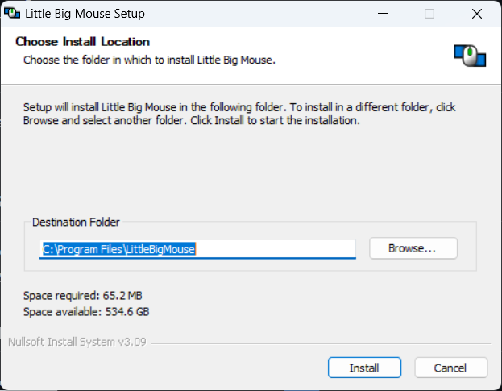
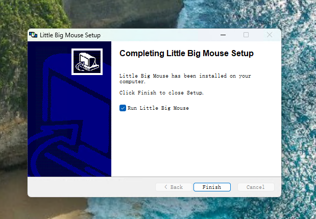
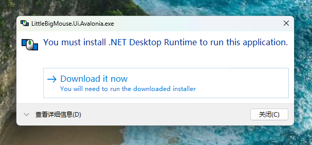
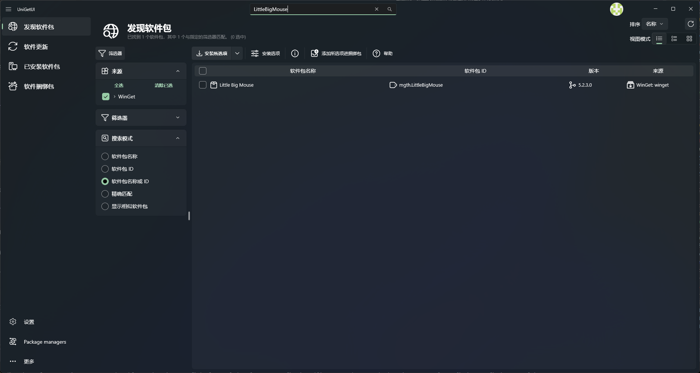
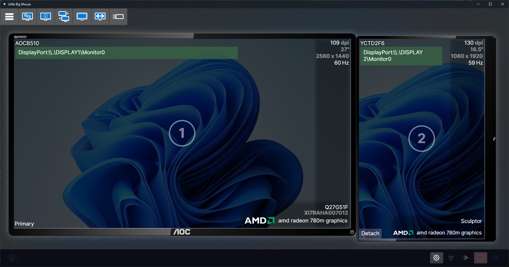
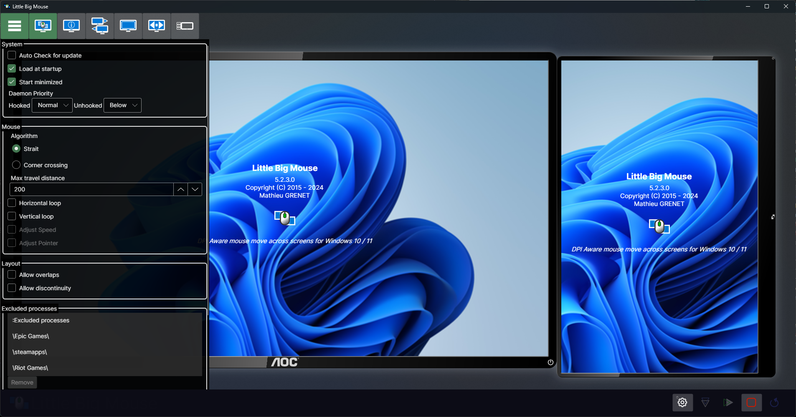
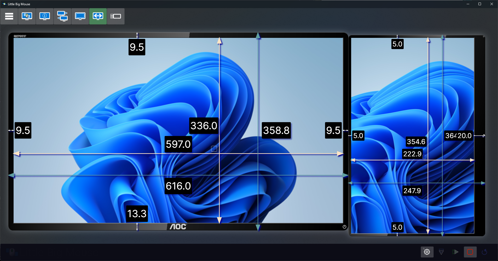
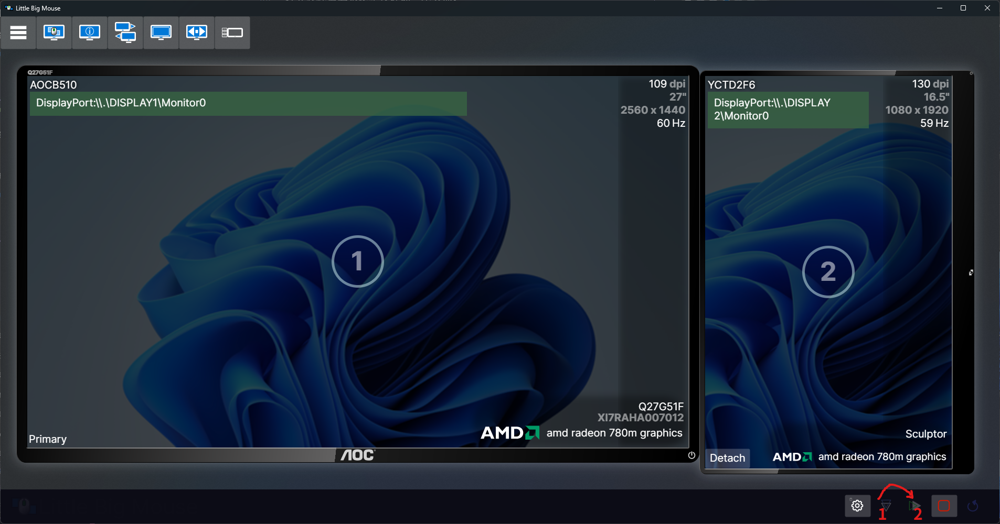

## 使用场景

因为在学习计算机，所以我就给自己配了一个副屏，但是沟槽的Windows判断屏幕大小的时候是以像素点来判断的，结果我的副屏就被判定的莫名其妙的大。

结果每次从副屏滑动到主屏的时候，鼠标会突然变化位置，看着就很难受。
最近我在GitHub上找到了一个开源项目[Little Big Mouse](https://github.com/mgth/littlebigmouse)，可以解决鼠标对不齐的问题。

不过需要注意的是，这个目前没办法解决窗口对齐问题，不过鼠标对其已经好受不少了。

## 部署到windows

我这里使用系统是windows11，其他系统没有测试过。

### 下载[Little Big Mouse](https://github.com/mgth/LittleBigMouse/releases/tag/v5.2.3)

点开链接，找到最新版，下载exe文件。

### 安装

安装目录看自己习惯。

保持默认就好

如果缺失依赖，按提示下载安装

或者可以使用UniGetUI下载：

直接一键部署，方便快捷

打开软件后差不多是这样的一个界面：

## 使用和设置

设置开机自启动以及启动最小化：

填入显示器实际大小：

然后保存并执行：

鼠标对齐问题解决啦！

## the end

软件的其他功能我就没研究了，但是基本功能已经满足我的需求了。

如果你感兴趣的话，可以自己研究一下。
就是这样。
